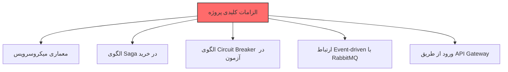
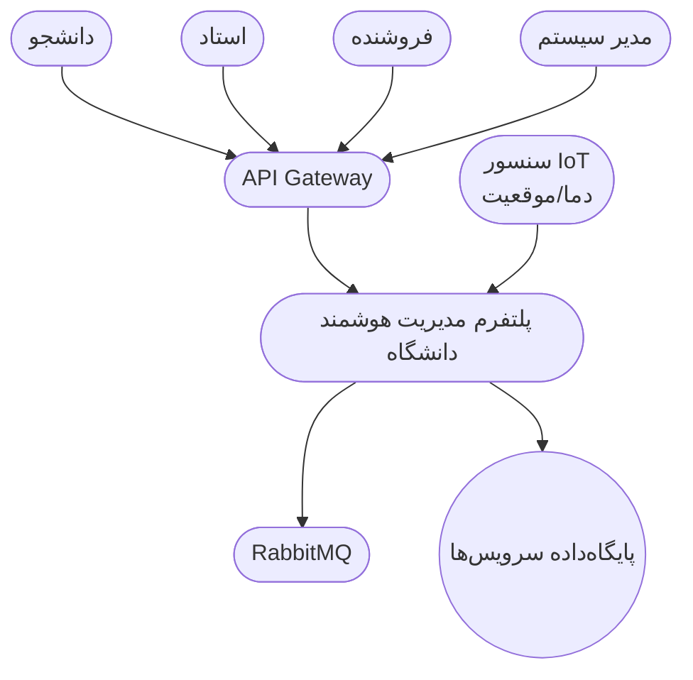
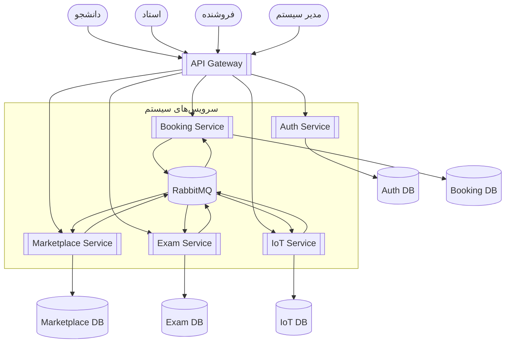
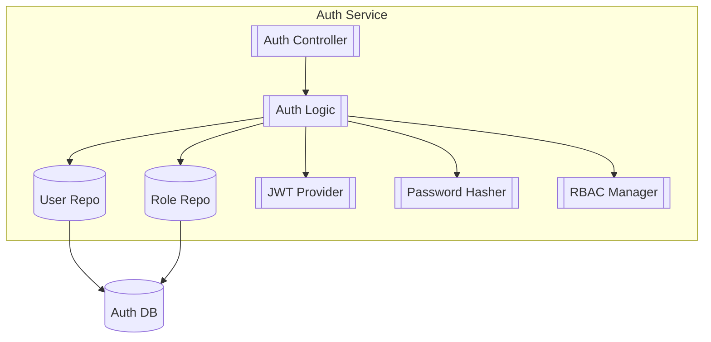
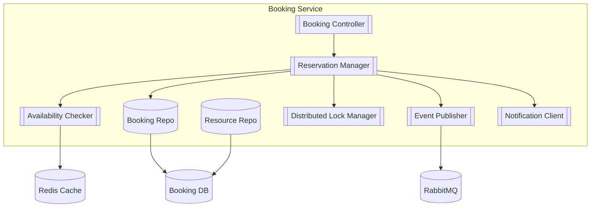
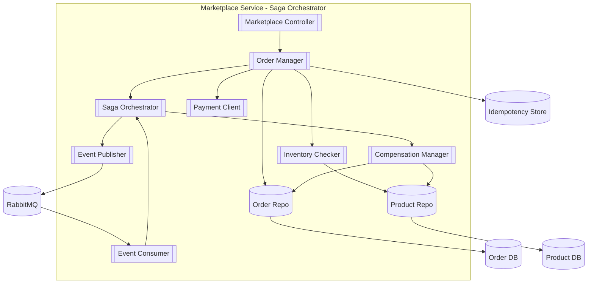
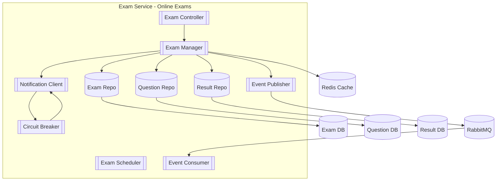
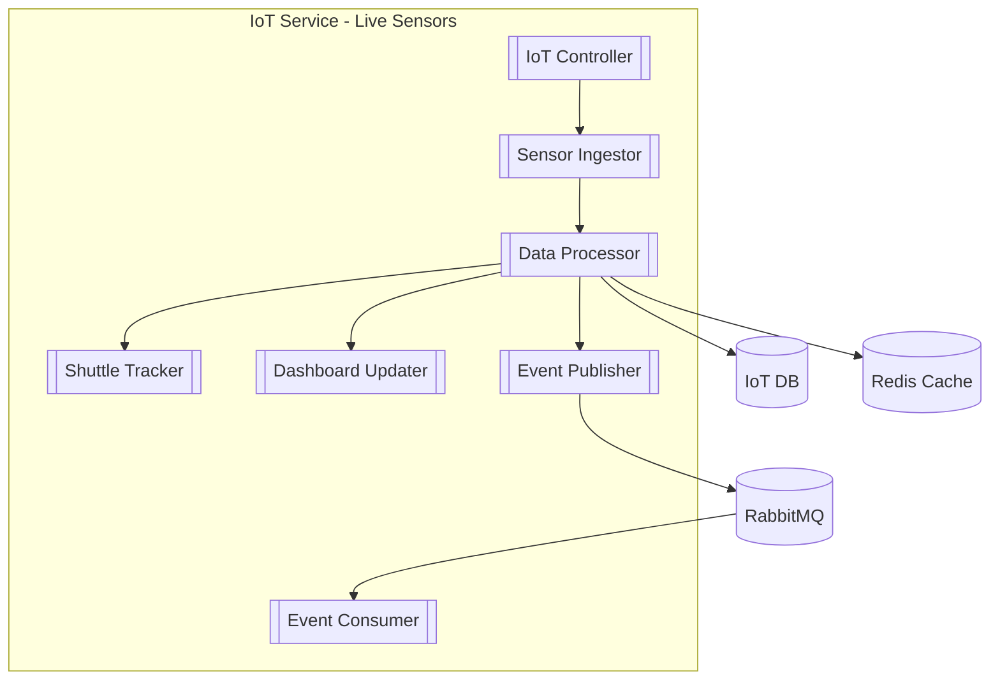

# 🎓 پروژه درس تحلیل و طراحی نرم‌افزار پیشرفته

**موضوع:** پلتفرم مدیریت هوشمند دانشگاه
**استاد:** دکتر فیضی
**مدت اجرا:** ۸ هفته
**تیم:** ۸ نفر + هوش مصنوعی (ChatGPT)

---

## 🔥 ۱. چشم‌انداز پروژه

این پروژه شبیه‌سازی یک سیستم واقعی Enterprise است که باید:

* مقیاس‌پذیر باشد
* event-driven باشد
* Microservices واقعی داشته باشد
* از RabbitMQ، Saga، Circuit Breaker استفاده کند
* API Gateway نقطه ورود باشد

هدف: ساخت **معماری حرفه‌ای، industry-level**.

---

## 🚨 ۲. الزامات کلیدی 

✔ Microservices
✔ Saga Pattern
✔ Circuit Breaker
✔ RabbitMQ
✔ API Gateway

---

# 📦 ۳. نیازمندی‌ها

### ۳.۱ نیازمندی‌های عملکردی (Functional Requirements)

| کد    | سرویس       | نیازمندی                        | توضیح            |
| ----- | ----------- | ------------------------------- | ---------------- |
| FR-01 | Auth        | ثبت‌نام/ورود                    | JWT              |
| FR-02 | Auth        | صدور JWT                        | Login Token      |
| FR-03 | Booking     | مشاهده منابع                    | اتاق‌ها، کلاس‌ها |
| FR-04 | Booking     | رزرو + جلوگیری از Overbooking   | قفل + چک تداخل   |
| FR-05 | Marketplace | تعریف محصول                     | توسط فروشنده     |
| FR-06 | Marketplace | الگوی Saga                      | خرید چندمرحله‌ای |
| FR-07 | Exam        | ساخت آزمون                      | استاد            |
| FR-08 | Exam        | شرکت در آزمون + Circuit Breaker | اعلان شروع       |
| FR-09 | IoT         | داده زنده سنسور                 | دما و کلاس       |
| FR-10 | IoT         | نقشه شاتل                       | موقعیت GPS       |

---

### ۳.۲ نیازمندی‌های غیرعملکردی (Non-Functional Requirements)

| کد       | عنوان            | پیامد معماری            |
| -------- | ---------------- | ----------------------- |
| NFR-S01  | مقیاس‌پذیری افقی | Stateless بودن سرویس‌ها |
| NFR-MT01 | Multi-Tenancy    | Schema-per-tenant       |
| NFR-P01  | Performance      | Cache و Async           |
| NFR-SE01 | Security         | JWT + RBAC              |
| NFR-R01  | Fault Tolerance  | Saga + Circuit Breaker  |

---

# 🧱 ۴. دیاگرام‌های C4

---

# 📘 Level 1 – System Context

> نمای کلی کاربران و سیستم

---

# 📗 Level 2 – Container Diagram

> سرویس‌ها + دیتابیس مستقل + RabbitMQ

---

# 🧩 Level 3 — Auth Service

> احراز هویت، JWT، Role Management

---

# 🧩 Level 3 – Resource & Booking Service

> رزرو، جلوگیری از Overbooking، Lock Manager

---

# 🧩 Level 3 — Marketplace Service

> فرآیند خرید با Saga + جبران (Compensation)

---

# 🧩 Level 3 — Exam Service

> شروع آزمون + Circuit Breaker + اعلان

---

# 🧩 Level 3 — IoT Service

> دریافت دادهٔ زنده — ردیابی شاتل — داشبورد

---

# 🎉 فاز ۱ – کاملاً تکمیل شد

تمام موارد موردنیاز طبق PDF درس:

✔ Level 1
✔ Level 2
✔ Level 3 برای ۵ سرویس
✔ Event-driven flows
✔ Saga / Circuit Breaker
✔ Fully GitHub-renderable
✔ نسخه نهایی و یکپارچه

اگر بخواهی:

📌 نسخه **PDF آمادهٔ ارائه** بسازم
📌 یا نسخه **DOCX** برای تحویل
📌 یا **دو صفحه خلاصه Executive Summary**

فقط بگو:
**PDF می‌خوام** یا **DOCX بساز**.
