# 🎓 پروژه درس تحلیل و طراحی نرم‌افزار پیشرفته

**موضوع:** پلتفرم مدیریت هوشمند دانشگاه
**استاد:** دکتر فیضی
**مدت اجرا:** ۸ هفته
**تیم:** ۸ نفر + هوش مصنوعی (ChatGPT)

---

## 🔥 ۱. چشم‌انداز پروژه
ما می‌خواهیم یک سیستم واقعی و کاربردی بسازیم که شبیه پلتفرم‌های دانشگاهی بزرگ باشد. هدف اصلی ما یادگیری معماری میکروسرویس و الگوهای پیشرفته مثل Saga و Circuit Breaker است.

می‌خواهیم بدانیم چطور شرکت‌های بزرگ سیستم‌های مقیاس‌پذیر می‌سازند و چگونه با چالش‌های واقعی مثل مدیریت خطا و داده‌های توزیع شده روبرو می‌شوند.

برای ما کیفیت و یادگیری عمیق مهم‌تر از تکمیل سریع پروژه است. می‌خواهیم در پایان بتوانیم با اطمینان بگوییم که از پس طراحی و پیاده‌سازی یک سیستم Enterprise-Level برمی‌آییم.

این پروژه برای ما مثل یک دوره عملی آماده‌سازی برای بازار کار است.

---

## 🚨 ۲. الزامات کلیدی 

```mermaid
graph TD
    A[الزامات کلیدی پروژه] --> B[معماری میکروسرویس]
    A --> C[ Saga در خرید الگوی]
    A --> D[ Circuit Breaker در آزمون الگوی]
    A --> E[با Event-driven ارتباط RabbitMQ ]
    A --> F[ API Gateway ورود از طریق]
    style A fill:#ff6b6b,stroke:#333,stroke-width:1.5
```

✔ Microservices
✔ Saga Pattern
✔ Circuit Breaker
✔ RabbitMQ
✔ API Gateway

---

## 🧱 ۳. نیازمندی‌ها

۳.۱ نیازمندی‌های عملکردی (Functional Requirements)

| کد    | سرویس       | نیازمندی                        | توضیح            |
| ----- | ----------- | ------------------------------- | ---------------- |
| FR-01 | Auth        | ثبت‌نام/ورود                    | JWT              |
| FR-02 | Auth        | صدور JWT                        | Login Token      |
| FR-03 | Booking     | مشاهده منابع                    | اتاق‌ها، کلاس‌ها |
| FR-04 | Booking     | رزرو + جلوگیری از Overbooking   | قفل + چک تداخل   |
| FR-05 | Marketplace | تعریف محصول                     | توسط فروشنده     |
| FR-06 | Marketplace | الگوی Saga                      | خرید چندمرحله‌ای |
| FR-07 | Exam        | ساخت آزمون                      | استاد            |
| FR-08 | Exam        | شرکت در آزمون + Circuit Breaker | اعلان شروع       |
| FR-09 | IoT         | داده زنده سنسور                 | دما و کلاس       |
| FR-10 | IoT         | نقشه شاتل                       | موقعیت GPS       |

۳.۲ نیازمندی‌های غیرعملکردی (Non-Functional Requirements)

| کد       | عنوان            | پیامد معماری            |
| -------- | ---------------- | ----------------------- |
| NFR-S01  | مقیاس‌پذیری افقی | Stateless بودن سرویس‌ها |
| NFR-MT01 | Multi-Tenancy    | Schema-per-tenant       |
| NFR-P01  | Performance      | Cache و Async           |
| NFR-SE01 | Security         | JWT + RBAC              |
| NFR-R01  | Fault Tolerance  | Saga + Circuit Breaker  |

---

## 🧱 ۴. دیاگرام‌های C4

📘 Level 1 – System Context

> نمای کلی کاربران و سیستم

```mermaid
flowchart TB
    Student([دانشجو])
    Teacher([استاد])
    Seller([فروشنده])
    Admin([مدیر سیستم])

    APIGateway([API Gateway])
    MainSystem([پلتفرم مدیریت هوشمند دانشگاه])
    MessageBroker([RabbitMQ])
    DBs((پایگاه‌داده سرویس‌ها))
    IoTDevice([سنسور IoT<br/>دما/موقعیت])

    Student --> APIGateway
    Teacher --> APIGateway
    Seller --> APIGateway
    Admin --> APIGateway

    APIGateway --> MainSystem
    MainSystem --> MessageBroker
    MainSystem --> DBs
    IoTDevice --> MainSystem
```

📗 Level 2 – Container Diagram

> سرویس‌ها + دیتابیس مستقل + RabbitMQ

```mermaid
flowchart TB

    Student([دانشجو])
    Teacher([استاد])
    Seller([فروشنده])
    Admin([مدیر سیستم])

    APIGateway[[API Gateway]]

    subgraph Services [سرویس‌های سیستم]
        AuthService[[Auth Service]]
        BookingService[[Booking Service]]
        MarketplaceService[[Marketplace Service]]
        ExamService[[Exam Service]]
        IoTService[[IoT Service]]
        MessageBroker[(RabbitMQ)]
    end

    AuthDB[(Auth DB)]
    BookingDB[(Booking DB)]
    MarketDB[(Marketplace DB)]
    ExamDB[(Exam DB)]
    IoTDB[(IoT DB)]

    Student --> APIGateway
    Teacher --> APIGateway
    Seller --> APIGateway
    Admin --> APIGateway

    APIGateway --> AuthService
    APIGateway --> BookingService
    APIGateway --> MarketplaceService
    APIGateway --> ExamService
    APIGateway --> IoTService

    AuthService --> AuthDB
    BookingService --> BookingDB
    MarketplaceService --> MarketDB
    ExamService --> ExamDB
    IoTService --> IoTDB

    MarketplaceService --> MessageBroker
    BookingService --> MessageBroker
    ExamService --> MessageBroker
    IoTService --> MessageBroker

    MessageBroker --> MarketplaceService
    MessageBroker --> BookingService
    MessageBroker --> ExamService
    MessageBroker --> IoTService
```

🧩 Level 3 — Auth Service

> احراز هویت، JWT، Role Management

🧩 Level 3 – Resource & Booking Service

> رزرو، جلوگیری از Overbooking، Lock Manager

🧩 Level 3 — Marketplace Service

> فرآیند خرید با Saga + جبران (Compensation)

🧩 Level 3 — Exam Service

> شروع آزمون + Circuit Breaker + اعلان

🧩 Level 3 — IoT Service

> دریافت دادهٔ زنده — ردیابی شاتل — داشبورد

